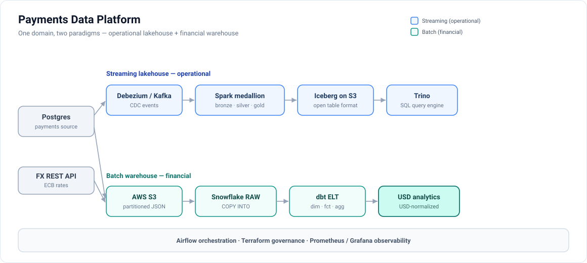
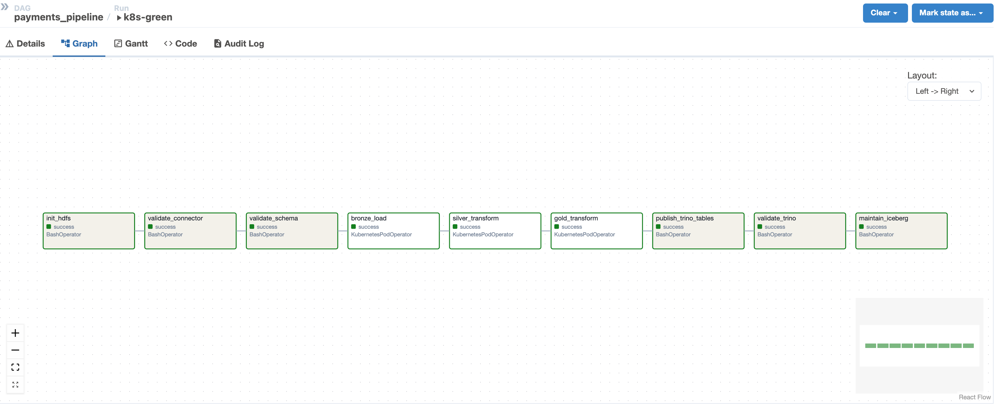
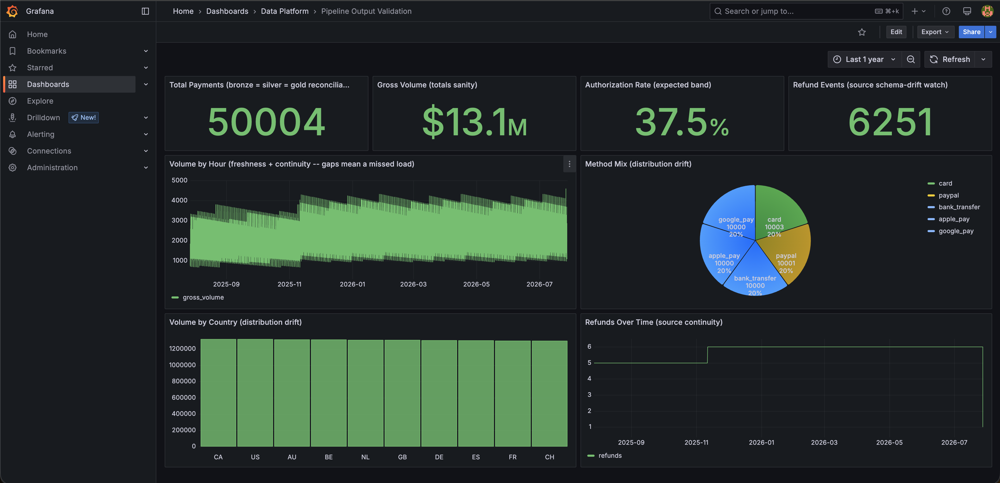
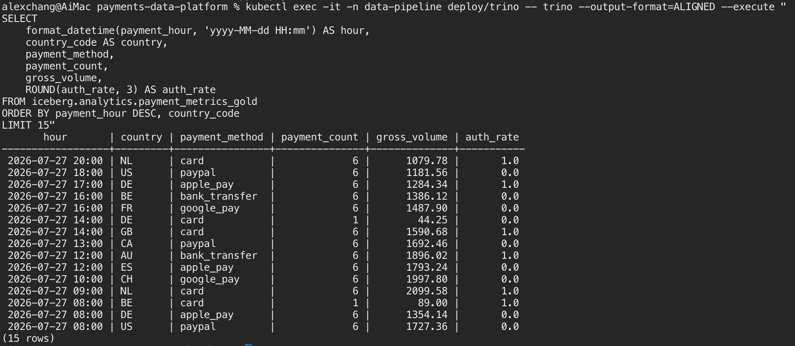

# Payments Data Platform

**Live site:** [cheng-alex-chang.github.io/payments-data-platform](https://cheng-alex-chang.github.io/payments-data-platform/) — visual tour + hosted dbt lineage browser.

A payments data-engineering project that runs **both** dominant analytics paradigms over one domain:

- **Streaming lakehouse (operational):** `Postgres → Debezium/Kafka Connect → Kafka → PySpark → Iceberg on HDFS → Trino` — near-real-time CDC on an open table format.
- **Batch cloud warehouse (financial):** `FX REST API + Postgres → AWS S3 → Snowflake + dbt` — incremental batch ELT that normalizes every payment to USD for cross-currency analytics over a star schema.

Shared across both: `Airflow` orchestration, `Terraform` governance (Databricks + Snowflake/S3), `Hive Metastore` as the Iceberg catalog, `Trino` interactive SQL over Iceberg, a `FastAPI` serving tier over gold, `Prometheus + Grafana` observability, and `pytest` + GitHub Actions CI.

See [docs/design.md](docs/design.md) for layer contracts (both pipelines), incremental processing, and CDC delete handling; [snowflake_etl/README.md](snowflake_etl/README.md) for the Snowflake FX ELT; and [docs/production-readiness.md](docs/production-readiness.md) for the hardening backlog.

## Deployment targets

The same medallion contract (bronze → silver → gold, CDC-aware) runs three ways:

| Target | What it is | Entry point |
|--------|------------|-------------|
| **Kubernetes (kind)** | The production-shaped deployment — the whole platform as Kustomize manifests (HDFS, Hive Metastore, Trino, Kafka/Debezium, Spark, Airflow, observability) | `bash scripts/k8s_up.sh` |
| **Docker Compose** | The fast inner loop — same services, same config files, one command, no cluster | `docker compose up -d` |
| **Databricks (Lakeflow)** | Serverless Unity Catalog + Delta port as a Lakeflow Declarative Pipeline — Auto Loader, AUTO CDC, expectations — deployed via an Asset Bundle | [`databricks/`](databricks/README.md) |

Kubernetes is the realistic target: nothing ships to production on Compose. Compose stays because
it starts in seconds and is the faster edit-run loop — the same split most teams actually run.
**Both read the identical config files**: the Kustomize ConfigMaps are generated straight from
`config/`, `airflow/dags/`, `scripts/`, and `sql/`, so the two runtimes cannot drift. The only
exceptions are three files under [`k8s/base/overrides/`](k8s/base/overrides) that must genuinely
differ on Kubernetes (pod memory ceilings, bind-host settings), each documenting why in its header.

## Architecture



**Streaming lakehouse** — near-real-time CDC into an open table format:

```text
Postgres
  -> Debezium / Kafka Connect            CDC via logical replication
  -> Kafka topic: cdc.public.payments
  -> Spark bronze job                    Structured Streaming -> Iceberg append
  -> Spark silver job                    foreachBatch -> Iceberg MERGE / DELETE
  -> Spark gold job                      Batch SQL -> Iceberg INSERT OVERWRITE
  -> Trino                               SQL over Iceberg via Hive Metastore
```

**Batch cloud warehouse** — a second source (FX rates) staged to S3, USD-normalized in Snowflake:

```text
FX REST API + Postgres
  -> stage_to_s3                         newline-JSON to S3, partitioned by dt
  -> Snowflake COPY INTO                 RAW VARIANT landing tables
  -> dbt ELT                             stg -> dim_date / dim_fx_rates -> fct_payments_usd (incremental)
  -> agg_payments_by_currency            monthly USD-normalized volume + FX drift
```

## Bronze, Silver, Gold

`Bronze`
- Raw Kafka envelope written to Iceberg, append-only
- Streaming with `trigger(availableNow=True)` and HDFS checkpoint
- PII fields (`shopper_id`) hashed with SHA-256 before the write so PII never lands in the lakehouse

`Silver`
- Canonical payment records, typed and normalised
- Dedup by `payment_id` (latest `updated_at`, tiebroken by `kafka_offset`) before MERGE so reruns and full Kafka replays converge to the same current state
- `foreachBatch` issues `MERGE INTO` for upserts (`op` in c, u, r) and `DELETE FROM` for Debezium deletes (`op=d`)

`Gold`
- Hourly aggregates per country and payment method (count, gross volume, auth rate)
- Reads only silver — strictly linear `bronze → silver → gold` lineage, no bronze or Debezium-envelope access
- Full idempotent recompute: one `GROUP BY` over silver, `INSERT OVERWRITE` replaces the whole table every run (so hours emptied by deletes drop out)

## Gold Serving API

The pipeline moves data inward — Postgres → CDC → Kafka → Spark → Iceberg → Trino. That gets an
analyst to a SQL prompt and Grafana to a chart, but nothing hands results back to an application.
A read-only **FastAPI** tier closes that loop over the same gold table. See [`api/`](api/README.md).

```bash
curl 'http://localhost:8000/v1/metrics/hourly?country_code=NL&limit=5'
curl 'http://localhost:8000/v1/metrics/summary?start=2026-03-01T00:00:00'
```

Four decisions carry the design:

- **Filters compile to SQL, not Python.** Gold is `PARTITIONED BY (days(payment_hour))`, so a bounded
  range lets Iceberg prune files before anything is read. Filtering in the process would make every
  request a full-table scan.
- **Keyset pagination, not `OFFSET`.** `OFFSET` makes the engine read and discard every skipped row;
  the cursor encodes the last `(payment_hour, country_code, payment_method)` seen, so page 500 costs
  what page 1 costs.
- **Cache keyed on the Iceberg snapshot id, not a TTL.** Every `INSERT OVERWRITE` on gold commits a
  new snapshot, so keying entries on it makes invalidation exact — a response can't outlive the data
  it was built from, and never expires early while the data is unchanged.
- **Money is a string on the wire.** `gross_volume` is `DECIMAL(18,2)`; as a JSON number it would
  reach a browser as an IEEE double and reintroduce the rounding the warehouse type prevents.

The whole suite runs with **no Trino driver installed and no warehouse reachable** — the driver is
imported lazily inside `connect_from_env`, so tests inject a fake DBAPI connection underneath the
real repository. That's why `trino` lives in `requirements-api.txt`, not `requirements-ci.txt`:
keeping it out of CI is what proves the lazy import still holds.

## Repo Layout

```text
airflow/dags/                  Airflow DAGs
api/src/                       FastAPI serving tier over the gold Iceberg table
config/airflow/                Airflow Docker image
config/api/                    Serving API Docker image
config/connect/                Debezium connector config
config/grafana/                Grafana provisioning and dashboards
config/hadoop/                 Hadoop config
config/hive-metastore/         Hive metastore config
config/postgres/init/          Postgres schema and seed data
config/prometheus/             Prometheus config
config/spark/jobs/             Spark jobs
config/statsd/                 StatsD exporter mapping for Airflow metrics
config/trino/                  Trino config and Iceberg catalog
config/trino-exporter/         Custom Trino REST -> Prometheus exporter
databricks/                    Databricks Lakeflow (DLT) port + Asset Bundle
docs/                          Design docs
infra/terraform/databricks/    Terraform for Databricks Unity Catalog governance (schema, volume, grants)
infra/terraform/snowflake/     Terraform for Snowflake + S3 governance (warehouse, role/grants, storage integration, stage)
k8s/                           Kubernetes manifests, local overlay, and kind cluster config
scripts/                       Helper scripts
snowflake_etl/                 Snowflake FX ELT: REST-API + Postgres -> S3 -> Snowflake (extractors, loader, SQL models, DAG)
sql/trino/                     Trino validation SQL
tests/                         Unit tests
```

## Run Locally

### Prerequisites

- `Docker Desktop`
- `docker compose`
- `Python 3`

### Start the platform

```bash
docker compose up -d
```

All long-running services use `restart: unless-stopped` and expose healthchecks (Kafka, NameNode, DataNode, Trino, Airflow, Postgres variants). Dependent services wait on `condition: service_healthy` before starting, so the stack self-recovers from individual container crashes without manual intervention.

### Register or refresh the Debezium connector

```bash
bash scripts/register_connector.sh
```

### Main URLs

- Airflow: `http://localhost:8088`
- Kafka Connect: `http://localhost:8083`
- Trino: `http://localhost:8080`
- HDFS NameNode UI: `http://localhost:9870`
- Payments Gold API: `http://localhost:8000/docs`
- Prometheus: `http://localhost:9090`
- Grafana: `http://localhost:3001`

### Load richer demo data

Fresh environments get the expanded demo seed automatically. If your containers and volumes already exist, reload the sample dataset into Postgres with:

```bash
python3 scripts/load_demo_data.py
```

Then trigger the Airflow DAG again so bronze, silver, and gold pick up the new CDC events.

### Run tests

```bash
source .venv/bin/activate
pytest --cov --cov-report=term-missing
```

## Kubernetes (production-shaped deployment)

`scripts/k8s_up.sh` creates a local `kind` cluster and applies the Kustomize overlay, rendering the
full platform: stateful databases, HDFS, Hive Metastore, Trino, Kafka/Connect, Spark job templates,
Airflow, observability (including provisioned Grafana datasources and dashboards), and analytics
UI workloads — 60 objects in total.

The ConfigMaps are generated from the repo's real config files rather than a copy kept in step by
hand, so a Spark job or seed script edit reaches both runtimes at once. Those paths sit outside the
kustomization root, so the render uses `--load-restrictor=LoadRestrictionsNone`; the tradeoff is
that the kustomization is no longer relocatable, which costs nothing for a repo-local overlay.

```bash
bash scripts/k8s_up.sh
export KUBECONFIG=.kind/kubeconfig
kubectl get statefulsets,pods,svc,pvc -n data-pipeline
python3 scripts/validate_k8s_manifests.py
```

Stop and remove the local cluster with:

```bash
bash scripts/k8s_down.sh
```

See [docs/kubernetes.md](docs/kubernetes.md) for the current Kubernetes scope, verification commands, and remaining runtime caveats.

The Kubernetes path has been verified end-to-end locally — Debezium connector registration, Bronze/Silver/Gold Spark Jobs, and Trino row-count validation all reconcile (bronze = silver = gold, currently ~50k payments over 12 months).

## Databricks (Lakeflow Declarative Pipeline)

The medallion is also ported to **Databricks** as a serverless **Lakeflow Declarative Pipeline** on Unity Catalog + Delta: Auto Loader ingestion, `apply_changes` (AUTO CDC) for the silver upsert/delete, and expectations for data quality — deployed as a Databricks Asset Bundle and orchestrated by a Workflow (seed → pipeline → validate).

Governance (the `analytics` schema and the `landing` volume) is provisioned declaratively with **Terraform** — a clean infra-vs-workload split: Terraform owns the Unity Catalog objects, the Asset Bundle owns the pipeline and Workflow. Terraform must `apply` first, because the seed job no longer self-creates the schema/volume:

```bash
terraform -chdir=infra/terraform/databricks init
terraform -chdir=infra/terraform/databricks apply   # creates workspace.analytics + landing volume

cd databricks
databricks bundle deploy -t dev
databricks bundle run payments_pipeline -t dev
```

Verified on Databricks Free Edition: the Delta tables reconcile 124 → 124 → 124 and all silver expectations report 124 passed / 0 failed. **Free Edition caveat:** `workspace` is a built-in catalog (not created by Terraform) and grants are restricted, so the Terraform scope is the schema + volume; the full grants showcase (`-var 'enable_grants=true'`) needs a standard workspace. See [databricks/README.md](databricks/README.md) for setup, the architecture diagram, and design notes.

## Snowflake FX ELT (batch + cloud warehouse)

A second ingestion pipeline runs the other dominant paradigm — **batch into a cloud warehouse** — over the same payments domain. A pull-based **FX-rates REST API** (Frankfurter / ECB) and the Postgres payments table (extracted **incrementally** by `updated_at` watermark) are staged to **AWS S3** as date-partitioned JSON, loaded into **Snowflake** `RAW` VARIANT tables with `COPY INTO`, then transformed by a **dbt** ELT — a Kimball-style star schema whose FX dimension forward-fills weekend/holiday gaps and whose incremental fact normalizes every payment to USD:

```text
FX REST API + Postgres → S3 (raw/<dataset>/dt=…) → Snowflake RAW (VARIANT)
  → stg_* → dim_fx_rates (forward-fill) → fct_payments_usd (amount × rate) → agg_payments_by_currency
```


It's orchestrated by an Airflow DAG (`airflow/dags/snowflake_fx_etl.py`) using TaskFlow `@task` for the S3 staging, `SnowflakeOperator` (managed `snowflake_default` connection) for the RAW load, and `dbt run` / `dbt test` for the transform + data-quality gates, with webhook failure alerting on both DAGs. **Terraform** (`infra/terraform/snowflake/`, remote S3 state) governs the database, RAW/ANALYTICS schemas, an XS auto-suspend warehouse, a least-privilege role, and the AWS↔Snowflake wiring (S3 bucket + storage integration + external stage); Snowflake auth is **key-pair** (password only as fallback). This is a deliberate **two-tier** design, not a duplicate of the lakehouse: the lakehouse serves *hourly operational* analytics; Snowflake serves *monthly, USD-normalized* financials.

Everything is verifiable offline (mocked S3, fake Snowflake cursor, `terraform validate`); the live load against a Snowflake 30-day trial + S3 Free Tier is a one-session activity that's then torn down. **Verified live:** `stage → COPY INTO → ELT` reconciles **50,004 == 50,004** payments with all four data-quality gates passing, yielding **$13.5M** in USD-normalized volume across 6 currencies. See **[snowflake_etl/README.md](snowflake_etl/README.md)** for the architecture, run commands, test tiers, and trial caveat, and [docs/production-readiness.md](docs/production-readiness.md) for the hardening backlog.

**Scale-tested to ~1 TB.** The same dbt project was benchmarked at **4.2 billion payments / 1.06 TB** of logical JSON, generated in-warehouse with `GENERATOR` — all **12 gates pass**, a 5M-row daily increment reconciles exactly, and the run quantifies the fix for the staging-view rescan bottleneck (`dim_date` build **9.5 min → 11s** when staging is materialized as a table). Full write-up: **[docs/scale-benchmark.md](docs/scale-benchmark.md)**.


## Airflow Pipeline

The main DAG is `airflow/dags/payments_pipeline.py`, and it orchestrates **both** runtimes:

1. `init_hdfs` — creates the warehouse and checkpoint directories over **WebHDFS**
2. `validate_connector` — Debezium connector and task are `RUNNING`
3. `validate_schema` — source schema matches what the pipeline expects
4. `bronze_load` · `silver_transform` · `gold_transform` — the Spark medallion
5. `publish_trino_tables` — the Iceberg tables are visible to Trino (and **fails** if one is missing)
6. `validate_trino` — bronze = silver = gold reconciliation
7. `maintain_iceberg` — compaction, snapshot expiry, orphan cleanup

Every task except the three Spark ones is **runtime-neutral**: it speaks HTTP to a service name
(`trino:8080`, `namenode:9870`) that resolves as a Compose service name and a Kubernetes Service
DNS name alike. No task shells into a container by name.

Spark submission is the one thing that genuinely differs, because Compose has no cluster to
schedule against. `airflow/dags/spark_jobs.py` returns a `KubernetesPodOperator` when
`PIPELINE_RUNTIME=kubernetes` and a `BashOperator` otherwise; the job specs live in one place and
tests assert the Compose command and the Kubernetes Job templates still agree with them.

Manual trigger:

```bash
# Compose
docker exec dp-airflow-webserver airflow dags trigger payments_pipeline

# Kubernetes
kubectl exec -n data-pipeline deploy/airflow-scheduler -- \
  airflow dags trigger payments_pipeline -r manual-1
```

## Demo Flow

### 1. Show the source data in Postgres

```bash
docker exec dp-postgres psql -U dataeng -d payments -c "SELECT payment_id, amount, payment_status, updated_at FROM payments ORDER BY payment_id;"
```

### 2. Change a source row

```bash
docker exec dp-postgres psql -U dataeng -d payments -c "UPDATE payments SET amount = 149.99, payment_status = 'authorized', updated_at = NOW() WHERE payment_id = 1001;"
```

### 3. Show the CDC event in Kafka

```bash
docker exec dp-kafka kafka-console-consumer \
  --bootstrap-server kafka:29092 \
  --topic cdc.public.payments \
  --from-beginning \
  --max-messages 1 \
  --timeout-ms 5000
```

### 4. Trigger the Airflow DAG

```bash
docker exec dp-airflow-webserver airflow dags trigger payments_pipeline
```

### 5. Confirm the DAG run

```bash
docker exec dp-airflow-webserver airflow dags list-runs -d payments_pipeline
```

### 6. Query the silver table in Trino

```bash
docker exec dp-trino trino --execute "SELECT payment_id, amount, payment_method, payment_status, created_at, updated_at FROM iceberg.analytics.payments_silver"
```

### 7. Query the gold table in Trino

```bash
docker exec dp-trino trino --execute "SELECT * FROM iceberg.analytics.payment_metrics_gold ORDER BY payment_hour, country_code, payment_method"
```

## Observability

Grafana is for **operating the platform**, not for business reporting. Business analytics is served
by the [gold API](api/README.md) — that is where a consumer should go for payment volume by country.
Prometheus is a metrics store, not an analytics store: pushing business dimensions
(country × method × merchant) into it causes cardinality explosion, and the data already lives in
Iceberg with full history.

Two provisioned dashboards, both in the `Data Platform` folder at `http://localhost:3001`:

**Platform Overview** — infrastructure and service health from Prometheus: Airflow scheduler
heartbeat, task completions by state, Trino query activity, and the gold API's request rate, p99
latency by endpoint, and snapshot-cache hit ratio.

**Pipeline Output Validation** — *is the pipeline producing sane output?* These panels read the
curated **gold** layer (`iceberg.analytics.payment_metrics_gold`) through **Trino**, so they catch
bad loads: row counts that stop reconciling, an authorization rate outside its plausible band, an
hour with no volume (a missed load), a sudden shift in method or country mix. The two refund panels
still read source Postgres — `refunds` is tracked for schema-drift only and has no silver/gold layer
yet (a separate refunds medallion is future work). Panels:

- total payments _(gold)_
- gross volume _(gold)_
- authorization rate _(gold, payment-weighted across hourly groups)_
- refund events _(source Postgres)_
- hourly volume trend _(gold)_
- payment method mix _(gold)_
- gross volume by country _(gold)_
- refunds over time _(source Postgres)_

Two states are expected and **not** bugs:
- **On first container start** Grafana downloads the `trino-datasource` plugin (`GF_INSTALL_PLUGINS`), which needs internet access.
- **Until the `payments_pipeline` DAG has run**, gold is empty, so the six gold panels render blank. That is by design — the dashboard now mirrors pipeline output, so no run means no data. Trigger the DAG and the panels populate.

## Project Tour

This project is easiest to understand when viewed from three angles:

- orchestration in Airflow
- CDC and analytics results in Kafka and Trino
- business-facing metrics in Grafana

Airflow shows the pipeline running from source validation through bronze, silver, gold, and downstream validation.



Grafana shows the seeded demo data as business-facing metrics, including volume, authorization rate, refunds, and payment method mix.



Trino shows the materialized gold layer directly, making it easy to inspect the hourly aggregates produced by the pipeline.



### Snowflake FX ELT

The batch pipeline normalizes every payment to USD in Snowflake. Native volume is nearly equal across the six currencies, but USD-normalized volume diverges purely from FX rates — the reason the pipeline exists.


The pipeline itself: two sources staged to S3, loaded into Snowflake RAW, and transformed to USD by dbt.


