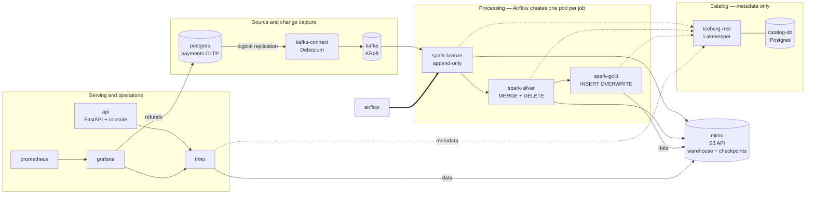

# Lakehouse architecture — target state after the storage/catalog migration

Written before Phase 4 deletes anything, so the deletion is checked against a stated target rather
than discovered by removing things and seeing what breaks. Every edge below was read out of the
running cluster's ConfigMaps, not from memory.

## Component diagram

Solid edges carry data; dotted edges carry metadata. The distinction is the point of the whole
migration: **the catalog is asked where a table is, then the engine reads the storage directly.**

## Layer contracts

| Layer | Written by | Pattern | Source of truth |
|---|---|---|---|
| bronze | `spark-bronze` | append-only, streaming from Kafka with `trigger(availableNow=True)` | Kafka topic |
| silver | `spark-silver` | `MERGE INTO` upserts + `DELETE` for CDC deletes, latest-per-key | bronze |
| gold | `spark-gold` | full `INSERT OVERWRITE` aggregate | silver |

Gold reads nothing from bronze — lineage stays strictly linear.

## Storage and catalog split

This is the part that changed, and the boundary that matters:

The catalog is **Lakekeeper**, chosen for being Rust rather than a JVM — it reserves 192 Mi where
Hive Metastore reserved 512 Mi, which matters on a single node. The choice is close to free to
revisit: `iceberg.catalog.type=rest` plus a URI is the entire engine-side configuration, and it is
byte-identical against Apache Polaris (Snowflake Open Catalog), Unity Catalog, Nessie, or Glue's
REST endpoint. The spec is the portable part; the implementation is a deployment detail.

- **Catalog (`iceberg-rest`)** owns table *metadata*: which tables exist, where their files live,
  what the current snapshot is. Engines reach it over HTTP at `iceberg-rest:8181/catalog`.
- **Storage (`minio`)** holds the *files*: Parquet data and Iceberg metadata under
  `s3://warehouse/iceberg/`, plus Structured Streaming checkpoints in a separate
  `s3://checkpoints/` bucket.
- **Engines authenticate to storage themselves.** `remote-signing-enabled` is `false` on the
  warehouse, so the catalog does not sign S3 requests and returns no access key; Spark and Trino use
  the credentials in their own environment. On real AWS the equivalent is STS with vended
  credentials.

Why signing is off is not cosmetic — see the Phase 3 section of
[migration-storage-catalog.md](migration-storage-catalog.md).

### Engine configuration, as deployed

| | Spark | Trino |
|---|---|---|
| catalog type | `rest` | `rest` |
| file IO | `S3FileIO` (Iceberg, AWS SDK v2) | `fs.native-s3.enabled` |
| Hadoop involvement | S3A only for `s3a://` checkpoints | **none** — `fs.hadoop.enabled=false` |

Trino has no Hadoop code path at all. Spark keeps the S3A connector solely because Structured
Streaming checkpoints are plain object-storage paths rather than Iceberg tables.

## Workload inventory

18 workloads run today because both stacks are up. Phase 4 removes three.

| Workload | Kind | Status after Phase 4 |
|---|---|---|
| `postgres` | StatefulSet | keep — source OLTP |
| `kafka`, `kafka-connect` | StatefulSet, Deployment | keep |
| `minio` | Deployment | keep — new |
| `iceberg-rest` | Deployment | keep — new |
| `metastore-db` | StatefulSet | keep, **rename to `catalog-db`** — tenant changes, instance does not |
| `trino` | Deployment | keep, reconfigured |
| `api` | Deployment | keep |
| `airflow-postgres`, `airflow-webserver`, `airflow-scheduler` | | keep |
| `prometheus`, `grafana`, `statsd-exporter`, `trino-exporter` | | keep |
| **`namenode`** | StatefulSet | **delete** |
| **`datanode`** | StatefulSet | **delete** |
| **`hive-metastore`** | Deployment | **delete** |

**15 workloads after.** PVC count stays at 6: HDFS's two go, MinIO's one arrives, and the rest are
unchanged.

## Phase 4 deletion checklist

Derived from the table above rather than from grepping and hoping.

**Manifests and config to remove**
- [ ] `k8s/base/hdfs.yaml`, `k8s/base/hive-metastore.yaml`
- [ ] `k8s/base/overrides/hdfs-site.xml` — leaves `overrides/` with two files
- [ ] `config/hadoop/` (`core-site.xml`, `hdfs-site.xml`)
- [ ] `config/hive-metastore/` and its image build
- [ ] `config/trino/catalog/hive.properties`
- [ ] `drivers/postgresql-*.jar` — only the metastore needed it
- [ ] `scripts/init_hdfs.py` and its tests
- [ ] Compose services `namenode`, `datanode`, `hive-metastore`; volumes `namenode_data`, `datanode_data`
- [ ] `hadoop-config` ConfigMap generator, and the Spark pods' mounts of it

**Renames**
- [ ] `metastore-db` → `catalog-db`; `METASTORE_*` secret keys → `CATALOG_*`

**Guards that must be updated in the same change**
- [ ] `scripts/k8s_verify.sh` arrays — the drift test fails otherwise
- [ ] `scripts/validate_k8s_manifests.py` `REQUIRED_OBJECTS`
- [ ] `tests/test_validate_k8s_manifests.py` — HDFS headless-Service assertions
- [ ] `tests/test_pipeline_runtime.py` — the `init_hdfs` unit tests

**Docs** — `README.md` (16 mentions), `docs/kubernetes.md` (26), `docs/design.md` (11),
`docs/index.html` (2), and `docs/images/architecture-overview.svg` must be redrawn.

## Known constraint, carried forward

Spark still needs `hadoop-aws` on the classpath for `s3a://` checkpoints. It cannot be removed
while silver reads bronze as an Iceberg stream, because Iceberg's micro-batch source writes its
offset log through `S3FileIO`, which only addresses `s3` URIs — so the checkpoint has to be on
object storage, and object storage reached by Spark outside Iceberg means S3A.

Removing it would mean replacing the incremental-batch stream with a hand-managed watermark, which
trades a documented pattern for bespoke state handling. Not worth it at this scale.
