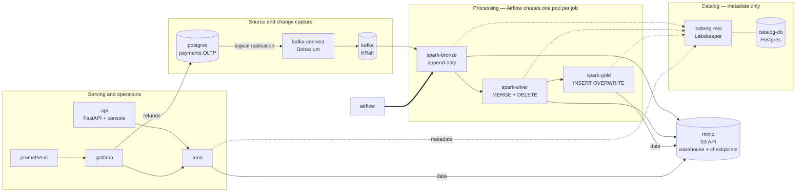

# Lakehouse architecture — target state after the storage/catalog migration

Written before Phase 4 deletes anything, so the deletion is checked against a stated target rather
than discovered by removing things and seeing what breaks. Every edge below was read out of the
running cluster's ConfigMaps, not from memory.

## Component diagram

Solid edges carry data; dotted edges carry metadata. The distinction is the point of the whole
migration: **the catalog is asked where a table is, then the engine reads the storage directly.**

## Layer contracts

| Layer | Written by | Pattern | Source of truth |
|---|---|---|---|
| bronze | `spark-bronze` | append-only, streaming from Kafka with `trigger(availableNow=True)` | Kafka topic |
| silver | `spark-silver` | one sequenced `MERGE INTO` applying all four CDC ops, ordered by Postgres LSN | bronze |
| gold | `spark-gold` | full `INSERT OVERWRITE` aggregate | silver |

Gold reads nothing from bronze — lineage stays strictly linear.

Silver applies inserts, updates and deletes in a **single** `MERGE`, guarded on
`s.source_lsn > t.source_lsn`. Both properties are load-bearing. A separate delete pass
made a delete-then-recreate of one key finish deleted regardless of sequence, and an
unguarded `UPDATE SET *` let a replayed batch overwrite newer state with older. Together
they are what make silver converge on replay rather than regress.

## Recovery contract

Bronze and silver hold independent Structured Streaming checkpoints; gold is a full
recompute with no state of its own. So the layers can be at different points in the stream,
and resetting one alone has consequences the code does not state. This table is the contract
— **reset what a row says to reset, together.**

| Scenario | Reset | Do not reset | Notes |
|---|---|---|---|
| Normal retry | nothing | — | Both jobs use `trigger(availableNow=True)`; a failed task re-runs from its own checkpoint. This is the default and covers most failures. |
| Silver logic change | silver checkpoint **and** `payments_silver` | bronze, bronze checkpoint | Replays bronze through the new logic. Safe because the merge is sequenced: re-applying old events cannot regress state. Rebuild gold afterwards. |
| Bronze replay detected | bronze checkpoint **and** `payments_bronze`, then silver as above | — | `assert_no_replayed_offsets` failed, so bronze holds duplicate `(topic, partition, offset)`. See below — this one is not a simple re-run. |
| Full rebuild | both checkpoints, all three tables | — | Only when the topic still retains everything needed. Verify retention first. |

Two rules that fall out of it:

- **Never reset a checkpoint without the table it feeds.** Resetting the bronze checkpoint
  alone re-consumes the topic into an append-only table and doubles the event history.
  Resetting `payments_silver` without its checkpoint leaves silver empty and the stream
  believing it has already delivered those batches.
- **Gold needs no decision.** It is `INSERT OVERWRITE` from silver, so re-running it after
  any of the above is always correct and never partial.

### Kafka retention is a window, not an archive

`assert_no_replayed_offsets` in `bronze_from_kafka.py` fails the run when a Kafka coordinate
appears in bronze twice, which means the topic was re-consumed — almost always a lost
checkpoint bucket. Recovery is deliberately manual, because "rebuild bronze from Kafka" is
only complete while the affected offsets are still retained.

Before rebuilding, check the topic's earliest available offset against what bronze needs. If
retention no longer covers it, a replay silently produces a *partial* history that looks
clean — no duplicates, no error, just missing events. In that case reconstruct from the
Iceberg snapshot history of `payments_bronze` (time-travel to before the duplication and
rewrite), or re-seed from Postgres and accept that pre-retention change history is gone.
Choosing between those is an operator decision; the pipeline will not make it silently.

## Storage and catalog split

This is the part that changed, and the boundary that matters:

The catalog is **Lakekeeper**, chosen for being Rust rather than a JVM — it reserves 192 Mi where
Hive Metastore reserved 512 Mi, which matters on a single node. The choice is close to free to
revisit: `iceberg.catalog.type=rest` plus a URI is the entire engine-side configuration, and it is
byte-identical against Apache Polaris (Snowflake Open Catalog), Unity Catalog, Nessie, or Glue's
REST endpoint. The spec is the portable part; the implementation is a deployment detail.

- **Catalog (`iceberg-rest`)** owns table *metadata*: which tables exist, where their files live,
  what the current snapshot is. Engines reach it over HTTP at `iceberg-rest:8181/catalog`.
- **Storage (`minio`)** holds the *files*: Parquet data and Iceberg metadata under
  `s3://warehouse/iceberg/`, plus Structured Streaming checkpoints in a separate
  `s3://checkpoints/` bucket.
- **Engines authenticate to storage themselves.** `remote-signing-enabled` is `false` on the
  warehouse, so the catalog does not sign S3 requests and returns no access key; Spark and Trino use
  the credentials in their own environment. On real AWS the equivalent is STS with vended
  credentials.

Why signing is off is not cosmetic — see the Phase 3 section of
[migration-storage-catalog.md](migration-storage-catalog.md).

### Engine configuration, as deployed

| | Spark | Trino |
|---|---|---|
| catalog type | `rest` | `rest` |
| file IO | `S3FileIO` (Iceberg, AWS SDK v2) | `fs.native-s3.enabled` |
| Hadoop involvement | S3A only for `s3a://` checkpoints | **none** — `fs.hadoop.enabled=false` |

Trino has no Hadoop code path at all. Spark keeps the S3A connector solely because Structured
Streaming checkpoints are plain object-storage paths rather than Iceberg tables.

## Workload inventory

18 workloads run today because both stacks are up. Phase 4 removes three.

| Workload | Kind | Status after Phase 4 |
|---|---|---|
| `postgres` | StatefulSet | keep — source OLTP |
| `kafka`, `kafka-connect` | StatefulSet, Deployment | keep |
| `minio` | Deployment | keep — new |
| `iceberg-rest` | Deployment | keep — new |
| `metastore-db` | StatefulSet | keep, **rename to `catalog-db`** — tenant changes, instance does not |
| `trino` | Deployment | keep, reconfigured |
| `api` | Deployment | keep |
| `airflow-postgres`, `airflow-webserver`, `airflow-scheduler` | | keep |
| `prometheus`, `grafana`, `statsd-exporter`, `trino-exporter` | | keep |
| **`namenode`** | StatefulSet | **delete** |
| **`datanode`** | StatefulSet | **delete** |
| **`hive-metastore`** | Deployment | **delete** |

**15 workloads after.** PVCs go from 6 to 5: HDFS's two go, MinIO's one arrives, and the Spark
checkpoint claim is deleted once checkpoints move to their own bucket.

## Phase 4 deletion checklist

Derived from the table above rather than from grepping and hoping.

**Manifests and config to remove**
- [x] `k8s/base/hdfs.yaml`, `k8s/base/hive-metastore.yaml`
- [x] `k8s/base/overrides/hdfs-site.xml` — leaves `overrides/` with two files
- [x] `config/hadoop/` (`core-site.xml`, `hdfs-site.xml`)
- [x] `config/hive-metastore/` and its image build
- [x] `config/trino/catalog/hive.properties`
- [x] `drivers/postgresql-*.jar` — only the metastore needed it
- [x] `scripts/init_hdfs.py` and its tests
- [x] Compose services `namenode`, `datanode`, `hive-metastore`; volumes `namenode_data`, `datanode_data`
- [x] `hadoop-config` ConfigMap generator, and the Spark pods' mounts of it

**Renames**
- [x] `metastore-db` → `catalog-db`; `METASTORE_*` secret keys → `CATALOG_*`

**Guards that must be updated in the same change**
- [x] `scripts/k8s_verify.sh` arrays — the drift test fails otherwise
- [x] `scripts/validate_k8s_manifests.py` `REQUIRED_OBJECTS`
- [x] `tests/test_validate_k8s_manifests.py` — HDFS headless-Service assertions
- [x] `tests/test_pipeline_runtime.py` — the `init_hdfs` unit tests

**Docs** — [x] `README.md`, `docs/kubernetes.md`, `docs/design.md`, `docs/index.html`, and
`docs/images/architecture-overview.svg` redrawn.

### What the checklist did not catch

Two items were ticked on a half-finished edit, and both survived to the end of Phase 5:

**The Compose services were deleted; `trino`'s `depends_on: hive-metastore` was not.** Compose
rejects a project whose `depends_on` names an undefined service, so `docker compose config` exited
1 and `docker compose up` could not start *anything*. The whole migration was verified on
Kubernetes, so nothing exercised the other runtime. Worse, the replacement was never added either
— Compose had no `iceberg-rest` service at all, while the README claimed the two runtimes resolved
the same service names.

**The `spark-checkpoints` volume outlived its reason.** It was introduced when file IO briefly went
through `HadoopFileIO` and checkpoints could not live on S3. Once `S3FileIO` came back and
`checkpoint_path()` returned `s3a://checkpoints/…`, the claim stayed mounted at `/checkpoints` in
all three Spark pods and was never written again — confirmed by mounting it after a full green run
and finding an empty directory, while MinIO held the real bronze and silver offset logs.

Both are the same failure as every other drift in this project: a reference with nothing asserting
it still pointed at something real. The guards in `tests/test_compose_manifest.py` now assert both —
every `depends_on` names a defined service, and every declared volume is mounted by some workload.

## Known constraint, carried forward

Spark still needs `hadoop-aws` on the classpath for `s3a://` checkpoints. It cannot be removed
while silver reads bronze as an Iceberg stream, because Iceberg's micro-batch source writes its
offset log through `S3FileIO`, which only addresses `s3` URIs — so the checkpoint has to be on
object storage, and object storage reached by Spark outside Iceberg means S3A.

Removing it would mean replacing the incremental-batch stream with a hand-managed watermark, which
trades a documented pattern for bespoke state handling. Not worth it at this scale.
